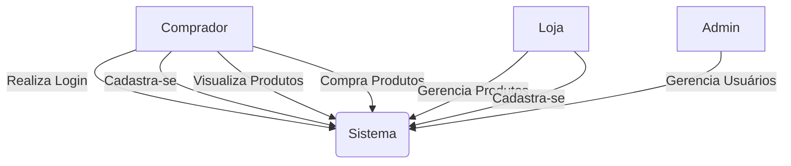
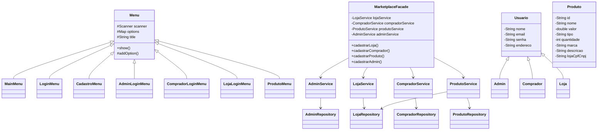
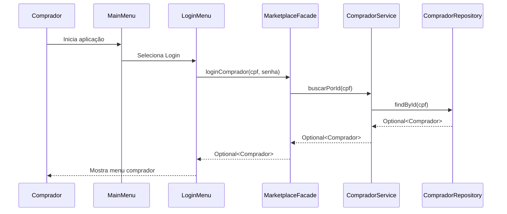
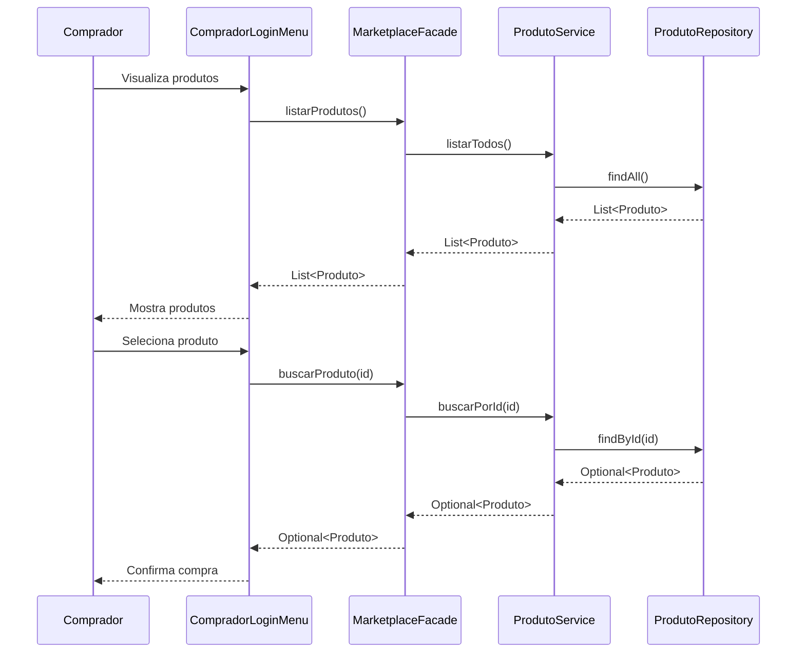
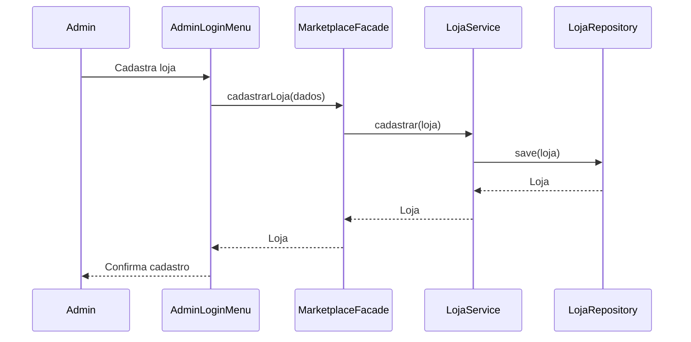
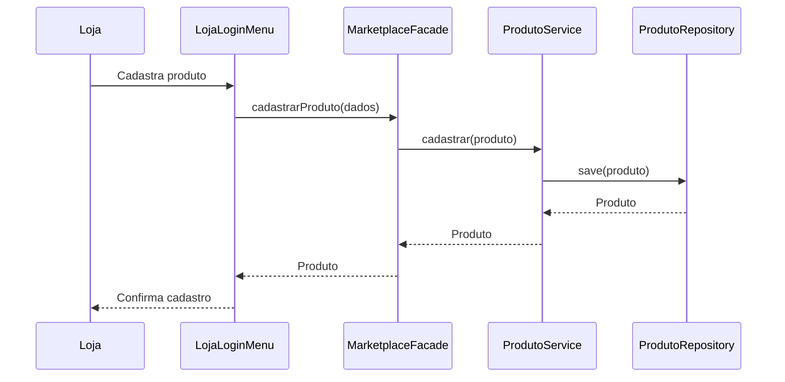

# Relatório Release 1 - Marketplace

## 1. Arquitetura

### 1.1 Diagrama de Casos de Uso

### 1.2 Diagrama de Classes

### 1.3 Diagrama de Sequência

## 2. Funcionalidades Desenvolvidas

### 2.1 Sistema de Login e Cadastro
- Implementado sistema de autenticação para três tipos de usuários
- Validação de dados cadastrais
- Gerenciamento de sessão

### 2.2 Gerenciamento de Produtos
- CRUD completo de produtos
- Validações de negócio
- Listagem por loja

### 2.3 Gerenciamento de Usuários
- Cadastro e atualização de dados
- Remoção de contas
- Níveis de acesso

## 3. Relatório de Testes

### 3.1 Cobertura de Código
   Linha: 85%
   Branch: 80%
   Complexidade: 75% 

-- prints
    
    
### 3.2 Testes Unitários
- Total de testes: X
- Passed: X
- Failed: 0
- Skipped: X