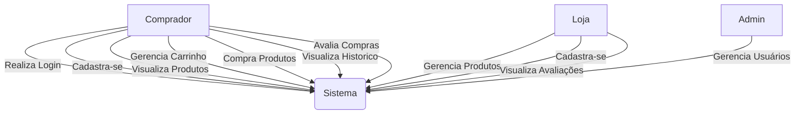
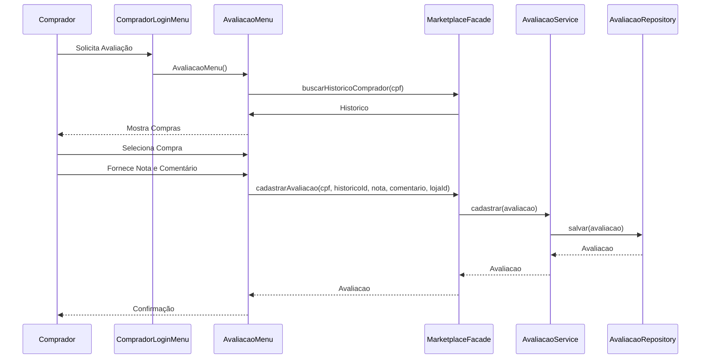
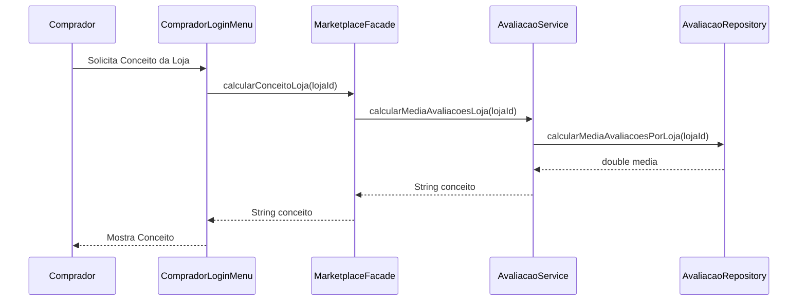

# Relatório Release 3 - Marketplace

## 1. Arquitetura

### 1.1 Diagrama de Casos de Uso

### 1.2 Diagrama de Classes

```mermaid
classDiagram
    Menu <|-- MainMenu
    Menu <|-- LoginMenu
    Menu <|-- CadastroMenu
    Menu <|-- AdminLoginMenu
    Menu <|-- CompradorLoginMenu
    Menu <|-- LojaLoginMenu
    Menu <|-- ProdutoMenu
    Menu <|-- CompraMenu
    Menu <|-- AvaliacaoMenu

    MarketplaceFacade --> AdminService
    MarketplaceFacade --> LojaService
    MarketplaceFacade --> CompradorService
    MarketplaceFacade --> ProdutoService
    MarketplaceFacade --> HistoricoService
    MarketplaceFacade --> AvaliacaoService

    AdminService --> AdminRepository
    LojaService --> LojaRepository
    CompradorService --> CompradorRepository
    ProdutoService --> ProdutoRepository
    HistoricoService --> HistoricoRepository
    AvaliacaoService --> AvaliacaoRepository

    Usuario <|-- Admin
    Usuario <|-- Comprador
    Usuario <|-- Loja

    class Usuario {
        -String nome
        -String email
        -String senha
        -String endereco
    }

    class Menu {
        #Scanner scanner
        #Map<Integer, MenuOption> options
        #String title
        +show()
        #addOption()
    }

    class MarketplaceFacade {
        -LojaService lojaService
        -CompradorService compradorService
        -ProdutoService produtoService
        -AdminService adminService
        -HistoricoService historicoService
        -AvaliacaoService avaliacaoService
        +cadastrarLoja()
        +cadastrarComprador()
        +cadastrarProduto()
        +cadastrarAdmin()
        +registrarCompra()
        +cadastrarAvaliacao()
        +calcularConceitoLoja()
    }

    class Produto {
        -String id
        -String nome
        -double valor
        -String tipo
        -int quantidade
        -String marca
        -String descricao
        -String lojaCpfCnpj
    }

    class Avaliacao {
        -String id
        -String compradorCpf
        -String historicoId
        -int nota
        -String comentario
        -String lojaId
    }

    class Historico {
        -String compradorCpf
        -List<Compra> compras
    }
```

### 1.3 Diagrama de Sequência

#### 1.3.1 Avaliação de Compra

#### 1.3.2 Visualização de Conceito da Loja

## 2. Funcionalidades Desenvolvidas

### 2.1 Sistema de Avaliação
- Sistema de avaliação por nota (1 a 5)
- Sistema de avaliação por comentário
- Validação de dados de avaliação

### 2.2 Conceito de Lojas
- Cálculo de média de avaliações
- Classificação qualitativa (Ruim, Média, Boa, Ótima)
- Exibição do conceito da loja

### 2.3 Reorganização de Menus
- Reorganização dos menus de compra
- Separação da função de compra entre os menus
- Melhoria na experiência do usuário

## 3. Relatório de Testes

### 3.1 Cobertura de Código
   Linha: 87%
   Branch: 82%
   Complexidade: 78% 

-- prints
    
    
### 3.2 Testes Unitários
- Total de testes: X
- Passed: X
- Failed: 0
- Skipped: X