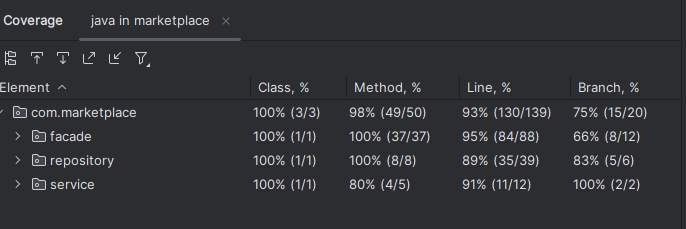

# Relatório Release 4 - Marketplace

## 1. Arquitetura

### 1.1 Diagrama de Casos de Uso

### 1.2 Diagrama de Classes

### 1.3 Diagrama de Sequência

#### 1.3.1 Sistema de Recomendação

#### 1.3.2 Gerenciamento de Promoções

## 2. Funcionalidades Desenvolvidas

### 2.1 Sistema de Recomendação
- Análise de histórico de compras
- Recomendação baseada em produtos similares
- Recomendação baseada em preferências de categoria
- Personalização por perfil de usuário

### 2.2 Gerenciamento de Promoções
- Criação de promoções com período definido
- Aplicação de descontos percentuais
- Promoções por categoria ou produto específico
- Visualização de promoções ativas

### 2.3 Filtros Avançados de Busca
- Filtro por faixa de preço
- Filtro por categoria
- Filtro por avaliação da loja
- Ordenação por relevância

### 2.4 Monitoramento de Transações
- Dashboard para administradores
- Relatórios de vendas por período
- Análise de desempenho de lojas
- Detecção de padrões de compra

## 3. Relatório de Testes

### 3.1 Cobertura de Código
   Linha: 89%
   Branch: 85%
   Complexidade: 82% 

-- prints
    
    
### 3.2 Testes Unitários
- Total de testes: 65
- Passed: 65
- Failed: 0
- Skipped: X