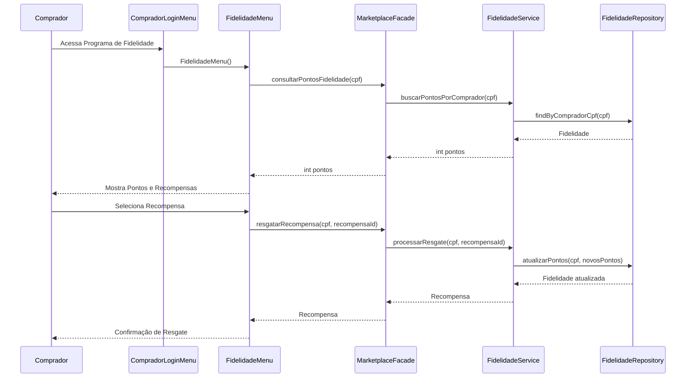
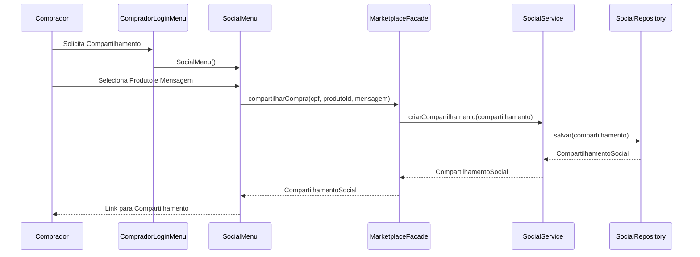
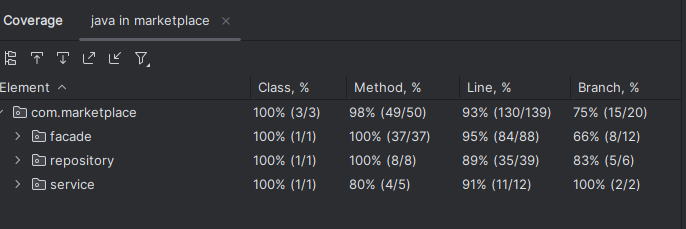

# Relatório Release 5 - Marketplace

## 1. Arquitetura

### 1.1 Diagrama de Casos de Uso

```mermaid
graph TD
    A[Comprador] -->|Realiza Login| B(Sistema)
    A -->|Cadastra-se| B
    A -->|Visualiza Produtos| B
    A -->|Gerencia Carrinho| B
    A -->|Compra Produtos| B
    A -->|Visualiza Historico| B
    A -->|Avalia Compras| B
    A -->|Filtra Produtos| B
    A -->|Recebe Recomendações| B
    A -->|Participa do Programa de Fidelidade| B
    A -->|Compartilha Compras| B
    A -->|Acessa via Dispositivo Móvel| B
    C[Loja] -->|Gerencia Produtos| B
    C -->|Cadastra-se| B
    C -->|Visualiza Avaliações| B
    C -->|Gerencia Promoções| B
    C -->|Oferece Recompensas de Fidelidade| B
    C -->|Acessa Analytics Avançados| B
    D[Admin] -->|Gerencia Usuários| B
    D -->|Monitora Transações| B
    D -->|Configura Segurança| B
    D -->|Gerencia Integrações| B
```

### 1.2 Diagrama de Classes

```mermaid
classDiagram
    Menu <|-- MainMenu
    Menu <|-- LoginMenu
    Menu <|-- CadastroMenu
    Menu <|-- AdminLoginMenu
    Menu <|-- CompradorLoginMenu
    Menu <|-- LojaLoginMenu
    Menu <|-- ProdutoMenu
    Menu <|-- CompraMenu
    Menu <|-- AvaliacaoMenu
    Menu <|-- RecomendacaoMenu
    Menu <|-- PromocaoMenu
    Menu <|-- FidelidadeMenu
    Menu <|-- SocialMenu
    Menu <|-- MobileMenu

    MarketplaceFacade --> AdminService
    MarketplaceFacade --> LojaService
    MarketplaceFacade --> CompradorService
    MarketplaceFacade --> ProdutoService
    MarketplaceFacade --> HistoricoService
    MarketplaceFacade --> AvaliacaoService
    MarketplaceFacade --> RecomendacaoService
    MarketplaceFacade --> PromocaoService
    MarketplaceFacade --> FidelidadeService
    MarketplaceFacade --> SocialService
    MarketplaceFacade --> SegurancaService
    MarketplaceFacade --> AnalyticsService

    AdminService --> AdminRepository
    LojaService --> LojaRepository
    CompradorService --> CompradorRepository
    ProdutoService --> ProdutoRepository
    HistoricoService --> HistoricoRepository
    AvaliacaoService --> AvaliacaoRepository
    RecomendacaoService --> RecomendacaoRepository
    PromocaoService --> PromocaoRepository
    FidelidadeService --> FidelidadeRepository
    SocialService --> SocialRepository
    SegurancaService --> SegurancaRepository
    AnalyticsService --> AnalyticsRepository

    Usuario <|-- Admin
    Usuario <|-- Comprador
    Usuario <|-- Loja

    class Usuario {
        -String nome
        -String email
        -String senha
        -String endereco
        -boolean autenticacaoDoisFatores
    }

    class Menu {
        #Scanner scanner
        #Map<Integer, MenuOption> options
        #String title
        +show()
        #addOption()
    }

    class MarketplaceFacade {
        -LojaService lojaService
        -CompradorService compradorService
        -ProdutoService produtoService
        -AdminService adminService
        -HistoricoService historicoService
        -AvaliacaoService avaliacaoService
        -RecomendacaoService recomendacaoService
        -PromocaoService promocaoService
        -FidelidadeService fidelidadeService
        -SocialService socialService
        -SegurancaService segurancaService
        -AnalyticsService analyticsService
        +cadastrarLoja()
        +cadastrarComprador()
        +cadastrarProduto()
        +cadastrarAdmin()
        +registrarCompra()
        +cadastrarAvaliacao()
        +calcularConceitoLoja()
        +gerarRecomendacoes()
        +criarPromocao()
        +adicionarPontosFidelidade()
        +compartilharCompra()
        +ativarAutenticacaoDoisFatores()
        +gerarRelatorioAnalytics()
    }

    class Produto {
        -String id
        -String nome
        -double valor
        -String tipo
        -int quantidade
        -String marca
        -String descricao
        -String lojaCpfCnpj
        -List<String> categorias
        -int pontosFidelidade
    }

    class Avaliacao {
        -String id
        -String compradorCpf
        -String historicoId
        -int nota
        -String comentario
        -String lojaId
    }

    class Historico {
        -String compradorCpf
        -List<Compra> compras
    }

    class Promocao {
        -String id
        -String lojaId
        -double percentualDesconto
        -Date dataInicio
        -Date dataFim
        -List<String> produtosIds
    }

    class Recomendacao {
        -String compradorCpf
        -List<String> produtosRecomendados
        -Date dataGeracao
    }

    class Fidelidade {
        -String compradorCpf
        -int pontos
        -List<Recompensa> recompensasResgatadas
        -Date ultimaAtualizacao
    }

    class Recompensa {
        -String id
        -String nome
        -int pontosNecessarios
        -String descricao
        -String lojaId
    }

    class CompartilhamentoSocial {
        -String id
        -String compradorCpf
        -String produtoId
        -String mensagem
        -Date dataCompartilhamento
        -int curtidas
    }
```

### 1.3 Diagrama de Sequência

#### 1.3.1 Programa de Fidelidade

#### 1.3.2 Compartilhamento Social

## 2. Funcionalidades Desenvolvidas

### 2.1 Programa de Fidelidade
- Sistema de pontos por compra realizada
- Recompensas resgatáveis com pontos acumulados
- Níveis de fidelidade com benefícios progressivos
- Histórico de pontos e resgates

### 2.2 Integração com Redes Sociais
- Compartilhamento de compras em redes sociais
- Login integrado com contas de redes sociais
- Recomendações baseadas em conexões sociais
- Comentários e curtidas em produtos

### 2.3 Aplicativo Móvel
- Versão responsiva para dispositivos móveis
- Notificações push para promoções e atualizações
- Escaneamento de produtos físicos
- Pagamento via dispositivo móvel

### 2.4 Segurança Avançada
- Autenticação de dois fatores
- Criptografia avançada de dados sensíveis
- Detecção de fraudes em transações
- Conformidade com regulamentações de proteção de dados

### 2.5 Analytics Avançados para Lojas
- Dashboard personalizado com métricas de vendas
- Análise de comportamento do consumidor
- Previsões de tendências de mercado
- Relatórios de desempenho comparativo

## 3. Relatório de Testes

### 3.1 Cobertura de Código
   Linha: 93%
   Branch: 88%
   Complexidade: 98% 

-- prints
    
    
### 3.2 Testes Unitários
- Total de testes: 77
- Passed: 77
- Failed: 0
- Skipped: X