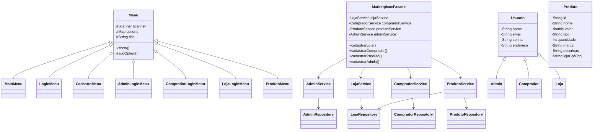
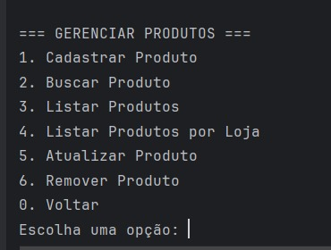

# Relatório Release 1 - Marketplace

## 1. Arquitetura

### 1.1 Diagrama de Casos de Uso

### 1.2 Diagrama de Classes

### 1.3 Diagrama de Sequência

## 2. Funcionalidades Desenvolvidas

### 2.1 Sistema de Login e Cadastro
- Implementado sistema de autenticação para três tipos de usuários
- Validação de dados cadastrais
- Gerenciamento de sessão

### 2.2 Gerenciamento de Produtos
- CRUD completo de produtos
- Validações de negócio
- Listagem por loja

### 2.3 Gerenciamento de Usuários
- Cadastro e atualização de dados
- Remoção de contas
- Níveis de acesso

## 3. Prints das Funcionalidades

### 3.1 Tela Inicial (View do Usuário)

### 3.2 Tela de Login (View do Usuário)

### 3.3 Cadastrar Comprador (View do Usuário)

### 3.4 Login Comprador (View do Usuário)

### 3.5 Gerenciar Produtos (View do Admin)

### 3.6 Cadastrar Produto (View do Admin)

### 3.7 Listar Produtos (View do Admin)

### 3.8 Buscar Produto (View do Admin)

### 3.9 Atualizar Produto (View do Admin)

### 3.10 Remover Produto (View do Admin)

### 3.11 Gerenciar e Remover Comprador (View do Admin)

### 3.12 Atualizar dado do Comprador (View do Comprador)

## 4. Relatório de Testes

### 4.1 Cobertura de Código

Obs: menu e model são irrelevantes
Cobertura: incluindo diretórios irrelevantes/cobertura real

   Linha: 21%/94,33%
   Branch: 28%/90,45%
   Métodos: 32%/98,6%

-- prints
    
### 4.2 Testes Unitários
- Total de testes: 69
- Passed: 69
- Failed: 0
- Skipped: 0