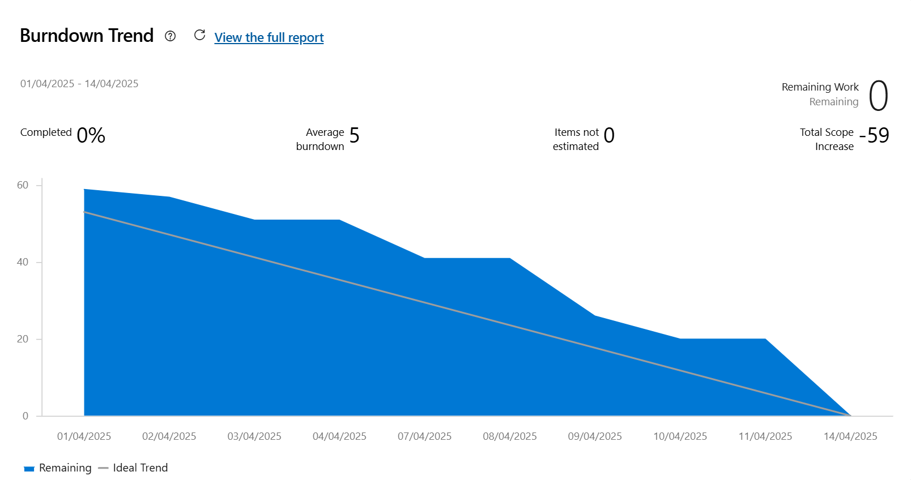
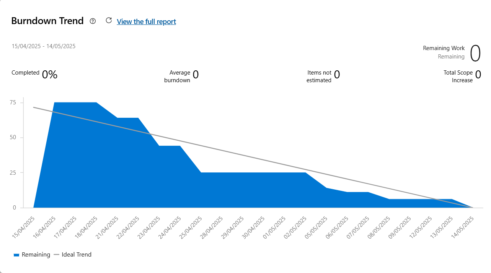

# Relatório de Processo - Release 2

## Sprint 3 (2 semanas)

### Backlog

1. Carrinho de compras
   - CRUD do carrinho de compras
   - Possibilidade de aplicar cupons
   - Desenvolver testes unitários
2. Refatoração
   - Correção do fluxo de compras
   - Testes unitários

### Organização da Equipe
- PO: Matheus Victor
- QA: Jhonatan Feitosa
- DEV: Vinícius Araújo
- DEV: Vitor Emanuel

### Burndown Chart

## Sprint 4 (4 semanas)

### Backlog

1. Venda de produtos
   - Gerenciamento do carrinho
   - Possibilidade de realizar a compra dos produtos selecionados
   - Desenvolver testes unitários
2. Histórico de pedidos
   - Histórico individual de produtos
   - Histórico individual de lojas dos produtos comprados
   - Testes unitários
3. Permanencia
   - Permanencia individual do carrinho
   - Permanencia de login de usuários no sistema por tempo limitado
   - Testes unitários
4. Refatoração
   - Refatoração do fluxo de Compradores
   - Refatoração do fluxo de Lojas
   - Refatoração do fluxo de Administradores

### Organização da Equipe
- PO: Vitor Emanuel
- QA: Vinícius Araújo 
- DEV: Jhonatan Feitosa
- DEV: Matheus Victor

### Burndown Chart

