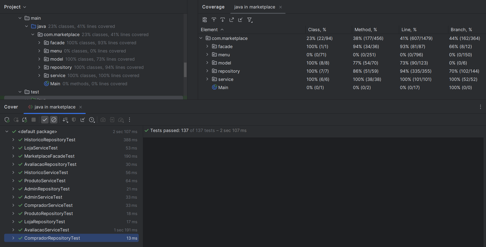

## 1. Relatório de Testes

### 1.1 Cobertura de Código

Obs: menu e model são irrelevantes
#### Cobertura: incluindo diretórios irrelevantes/cobertura real

- Linha: 21%/94,33%
- Branch: 28%/90,45%
- Métodos: 32%/98,6%

-- prints

### 1.2 Testes Unitários
- Total de testes: 69
- Passed: 69
- Failed: 0
- Skipped: 0