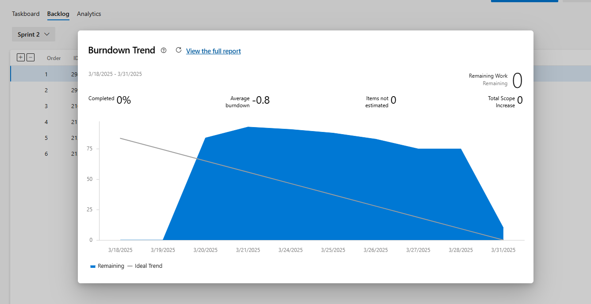

# Relatório de Processo - Release 1

## Sprint 1 (2 semanas)

### Backlog
1. Setup inicial do projeto
   - Configurar ambiente de desenvolvimento
   - Criar estrutura básica do projeto

2. Implementação do core
   - Criar models básicos
   - Implementar repositories
   - Desenvolver gereciamento principais
     - CRD Admin
     - CRD Lojas
     - testes unitários
3. Sistema de autenticação
    - Implementar login
    - Criar cadastro de usuários
    - Desenvolver validações

### Organização da Equipe
- PO: Vinícius Araújo
- QA: Vitor Emanuel
- DEV: Matheus Victor

### Burndown Chart

## Sprint 2 (2 semanas)

### Backlog

1. Evolução do core
   - Update de Admin
   - Update de Lojas
   - Desenvolver testes unitários
2. Gerenciamento de produtos
   - CRUD de produtos
   - Validações de negócio
   - Testes unitários 
2. Gerenciamento de compradores
   - CRUD de compradores
   - Validações de negócio
   - Testes unitários

### Organização da Equipe
- PO: Jhonatan Feitosa
- QA: Matheus Victor
- DEV: Vitor Emanuel
- DEV: Vinícius Araújo

### Burndown Chart

## Sprint 4 (4 semanas)

### Backlog

1. Venda de produtos
   - Gerenciamento do carrinho
   - Possibilidade de realizar a compra dos produtos selecionados
   - Desenvolver testes unitários
2. Histórico de pedidos
   - Histórico individual de produtos
   - Histórico individual de lojas dos produtos comprados
   - Testes unitários
3. Permanencia
   - Permanencia individual do carrinho
   - Permanencia de login de usuários no sistema por tempo limitado
   - Testes unitários
4. Refatoração
   - Refatoração do fluxo de Compradores
   - Refatoração do fluxo de Lojas
   - Refatoração do fluxo de Administradores

### Organização da Equipe
- PO: Vitor Emanuel
- QA: Vinícius Araújo 
- DEV: Jhonatan Feitosa
- DEV: Matheus Victor

### Burndown Chart
