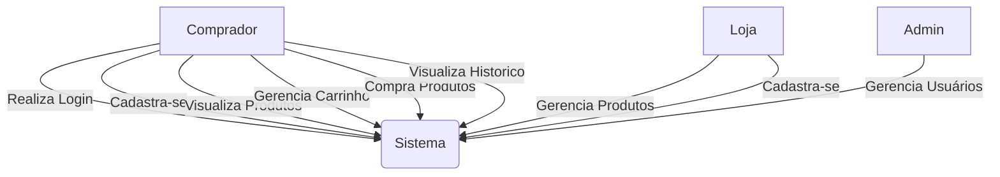
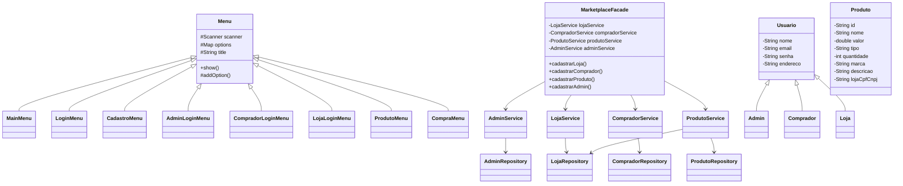
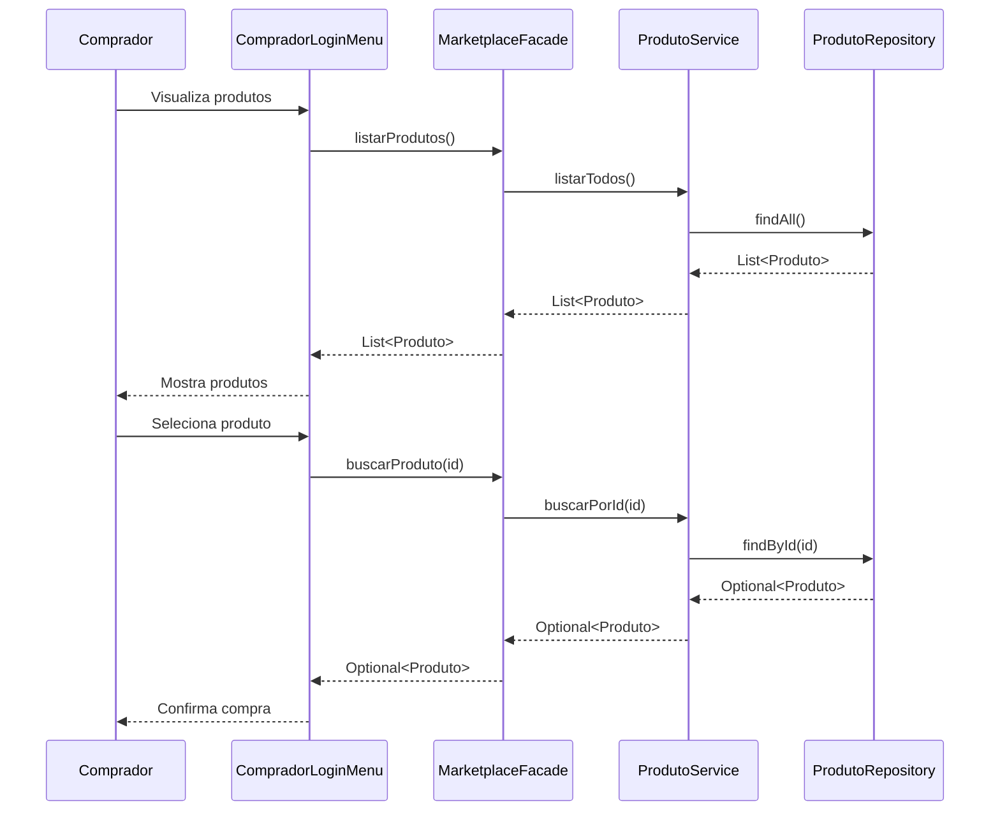
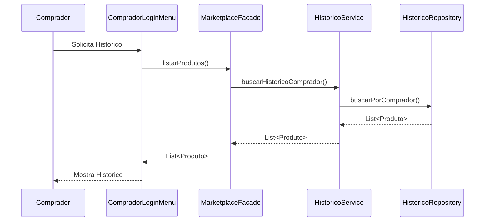
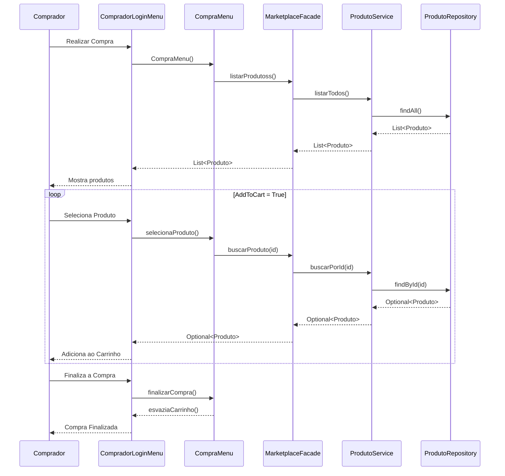

# Relatório Release 2 - Marketplace

## 1. Arquitetura

### 1.1 Diagrama de Casos de Uso

### 1.2 Diagrama de Classes

### 1.3 Diagrama de Sequência

#### 1.3.1 Compra com Carrinho

#### 1.3.1 Solicitar Histórico

#### 1.3.1 Compra Com Carrinho

## 2. Funcionalidades Desenvolvidas

### 2.1 Carrinho de Compras
- CRUD do carrinho de compras
- Possibilidade de aplicar cupons

### 2.2 Vendas de Produtos
- Gerenciamento do carrinho de compras (adicionar, remover)
- Possibilidade de realizar a compra dos produtos selecionados

### 2.3 Histórico de Compras
- Histórico individual de produtos
- Histórico individual de lojas dos produtos comprados

### 2.4 Permanência
- Permanencia individual do carrinho
- Permanencia de login de usuários no sistema por tempo limitado

## 3. Relatório de Testes

### 3.1 Cobertura de Código
   Linha: 85%
   Branch: 80%
   Complexidade: 75% 

-- prints
    
    
### 3.2 Testes Unitários
- Total de testes: X
- Passed: X
- Failed: 0
- Skipped: X